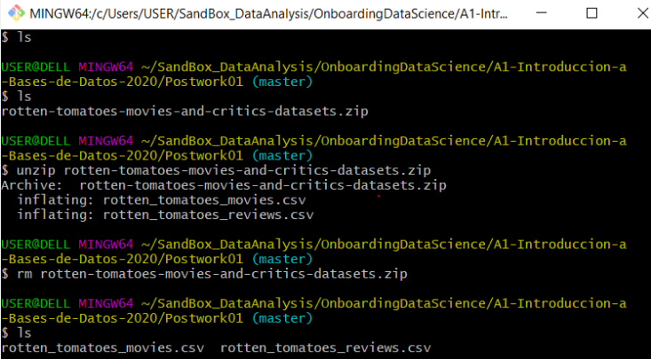
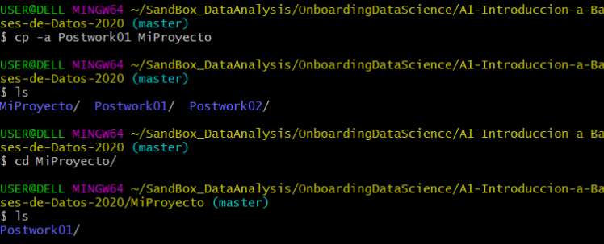

## Postwork

### OBJETIVOS

- Aplicar los conceptos de la sesión a tu proyecto personal
- Automatizar las tareas que sean factibles
- Contar con una estructura de carpetas para tu proyecto
- Contar con un conjunto de datos

#### REQUISITOS

1. Git Bash instalado (Windows)
2. Carpeta de repositorio actualizada


#### DESARROLLO

##### Planteamiento del proyecto

A lo largo del programa deberás desarrollar un proyecto. En este postwork, debes definir con qué conjunto de datos vas a trabajar, si es un proyecto de datos propios o vas a seleccionar algún conjunto de datos público.

Si haces uso de los datos públicos a continuación algunas sugerencias para buscar y descargar conjuntos de datos
   - https://datos.gob.mx
   - https://grouplens.org
   - https://www.kaggle.com
   - https://archive.ics.uci.edu/ml/datasets.php


1. Definir una estructura de carpetas para tu proyecto, cuando menos crea una carpeta donde ir guardando todos los archivos y resultados
   ```console
   $ mkdir MiProyecto
   $ cd MiProyecto
   MiProyecto $
   ```
   Si necesitas más carpetas siéntete libre de crear cuantas necesites.

1. Descarga u obtén el conjunto de datos elegido y colocalo dentro de la carpeta de tu proyecto.
   ```console
   MiProyecto $ curl -O URL-al-conjunto-de-datos
   [...]
   MiProyecto $ unzip archivo.zip  # Sólo en caso de requerir descomprimir
   MiProyecto $ rm archivp.zip  # Elimina el archivo zip en caso de existir
   MiProyecto $



1. Crea una copia de respaldo de tu proyecto, nunca está de más
   ```console
   MiProyecto $ cd ..
   $ cp -a MiProyecto MiProyecto.1
   $ ls
   MiProyecto MiProyecto.1
   $
   ```



Puedes decidir crear un respaldo de alguna otra carpeta, según sea necesario.
Si observas que algunas tareas se podrían realizar continuamente, posiblemente sea bueno crear un script para automatizar estas tareas, entonces crea uno o más script que realicen las cosas por tí, como es el caso de preparar las carpetas, obtener los archivos o eliminar archivos temporales.
Si creas un script recuereda que puede realizarlo con el editor nano desde la terminal y para ejecutarlo utiliza el comando bash.
Es recomendable validar los resultado de cada script para tener la certeza de que realizan exactamente lo que se necesita.

### AQUÍ PUEDES VER EL DETALLE DE MI POSTWORK EN DOC: 
https://docs.google.com/document/d/1vqKvbUB-UQv8F1PdNe1d_G0PV5RSuy_x9ujdj9TMTpY/edit?usp=sharing

