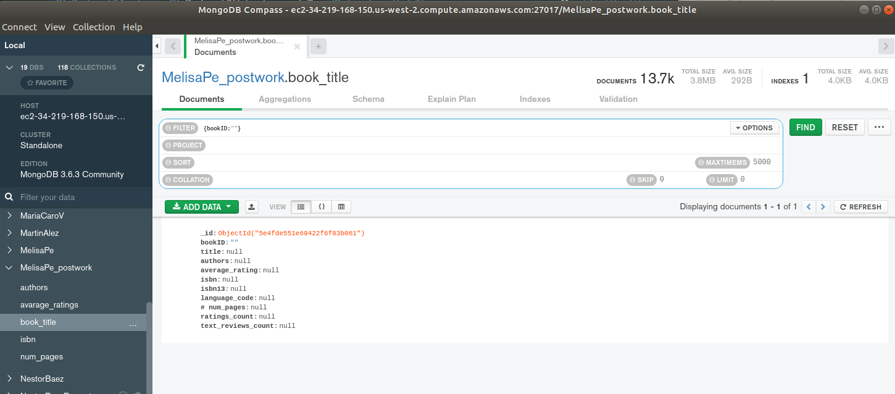
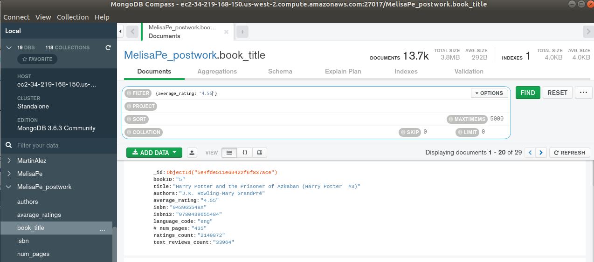
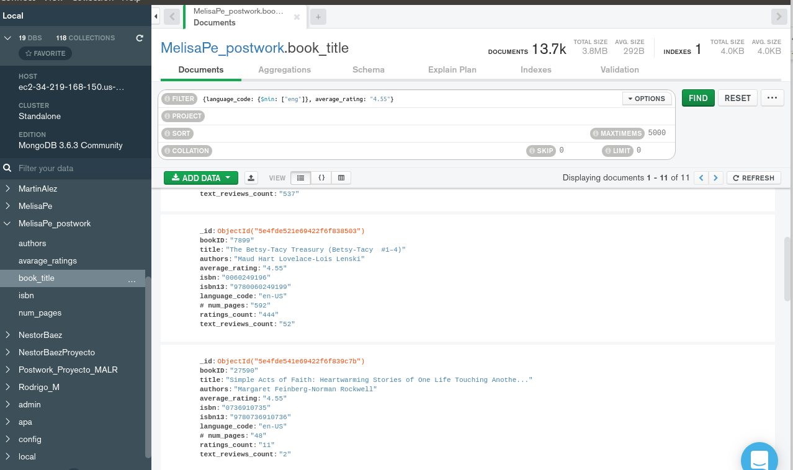
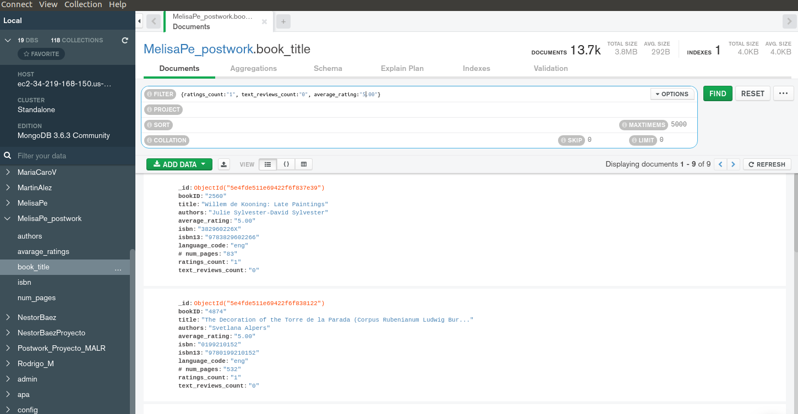

Postwork
## Fundamentos de MongoDB e importación de datos

### OBJETIVO
- [ ] Crear una Base de Datos en MongoDB para tú proyecto personal
- [ ] Crear las Colecciones necesarias para los distintos archivos
- [ ] Importar datos y validar la correcta importación
- [ ] Realizar consultas en base a filtrado de datos

### REQUISITOS
- [ ] Repositorio actualizado
- [x] Usar la carpeta de trabajo `Sesion-05/Postwork`
- [x] __MongoDB Compass__ iniciado y conectado al servidor de MongoDB
- [x] Carpeta de `Datos/` generado en el `Postwork` del la `Sesion-02`

### DESARROLLO

#### (1) Base de Datos

*Aquí pongan el nombre de su base de datos y la o las colecciones que crearon.*

```
Base de datos: MelisaPe_postwork
Colección: book_title
```

#### (2) Estructura del archivo CSV

*Header del archivo CSV que usaron como dataset*


```
bookID,title,authors,avarage_rating,isbn,isbn13,language_code,# num_pages, ratings_count,text_reviews_count
```

#### (3) Consultas

1. ¿Había algún campo nulo?
```json
{bookID:""}
```



2. ¿Cuántos libros tienen rating de 4.55?

```json
// FILTER
{average_rating: "4.55"}
```


3. ¿Cuántos libros que no están en inglés y tienen un rating de 4.55?

```json
{language_code: {$nin: ["eng"]}, average_rating: "4.55"} 
```




4. ¿Cuántos libros tienen rating de 5?

```json
// SORT
{average_rating: -1}
```


*Solución:* Son 25 libros que tienen un rating de 5 cerrado


5. ¿Cuántos libros tienen rating de 5 pero nada de reviews y su cuenta es 1?
```json
{ratings_count:"1", text_reviews_count:"0", average_rating:"5.00"}
```



