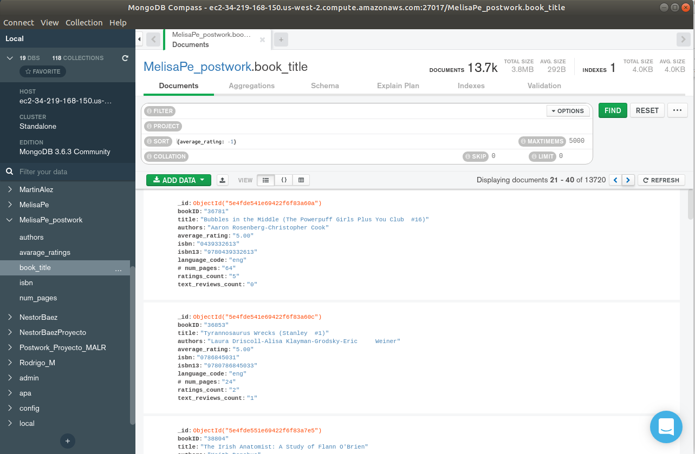

Postwork
## Fundamentos de MongoDB e importación de datos

### OBJETIVO
- [ ] Crear una Base de Datos en MongoDB para tú proyecto personal
- [ ] Crear las Colecciones necesarias para los distintos archivos
- [ ] Importar datos y validar la correcta importación
- [ ] Realizar consultas en base a filtrado de datos

### REQUISITOS
- [ ] Repositorio actualizado
- [x] Usar la carpeta de trabajo `Sesion-05/Postwork`
- [x] __MongoDB Compass__ iniciado y conectado al servidor de MongoDB
- [x] Carpeta de `Datos/` generado en el `Postwork` del la `Sesion-02`

### DESARROLLO

#### (1) Base de Datos

*Aquí pongan el nombre de su base de datos y la o las colecciones que crearon.*

```
Base de datos: MelisaPe_postwork
Colección: book_title
```

#### (2) Estructura del archivo CSV

*Aquí pongan el header del archivo CSV que usaron como dataset. La idea es que contrasten los documentos cargados en MongoDB con este header para asegurar que la carga fue correcta.*

{"_id":
    {"$oid":"5e4fde511e69422f6f837aca"}, 
    "bookID":"1",
    "title":"Harry Potter and the Half-Blood Prince (Harry Potter  #6)",
    "authors":"J.K. Rowling-Mary GrandPré",
    "average_rating":"4.56",
    "isbn":"0439785960",
    "isbn13":"9780439785969",
    "language_code":"eng",
    "# num_pages":"652",
    "ratings_count":"1944099",
    "text_reviews_count":"26249"}

```
bookID,title,authors,avarage_rating,isbn,isbn13,language_code,# num_pages, ratings_count,text_reviews_count
```

#### (3) Consultas

1. ¿Había algún campo nulo?
```json
{bookID:""}
```


2. ¿Cuántos libros tienen rating de 4.55?

```json
// FILTER
{average_rating: "4.55"}
```


3. ¿Cuántos libros que no están en inglés y tienen un rating de 4.55?

```json
{language_code: {$nin: ["eng"]}, average_rating: "4.55"} 
```


4. ¿Cuántos libros tienen rating de 5?

```json
// SORT
{average_rating: -1}
```


*Solución:* Son 25 libros que tienen un rating de 5 cerrado


5. ¿Cuántos libros tienen rating de 5 pero nada de reviews y su cuenta es 1?
```json
{ratings_count:"1", text_reviews_count:"0", average_rating:"5.00"}
```


