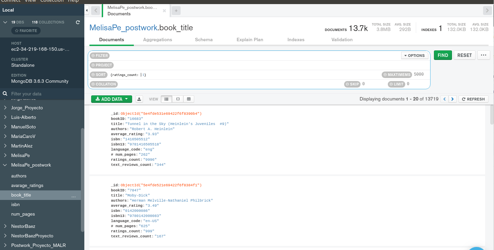
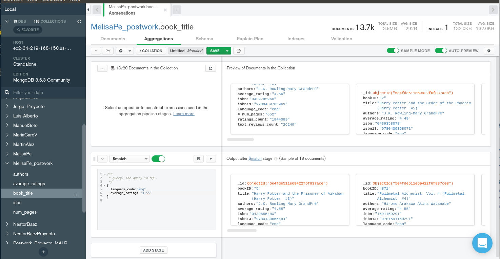

[`Fundamentos de Base de Datos`](../../Readme.md) > [`Sesión 06`](../Readme.md) > Postwork
## Consultas con MongoDB a datos estructurados
### Plantilla Postwork

#### (1) Base de Datos

*Aquí pongan el nombre de su base de datos y la o las colecciones que crearon.*

```
Base de datos: MelisaPe_postwork
Colección: book_title
```

#### (2) Consultas

1. Ordenar los rating de reseñas en orden ascendente

```json
{ratings_count: -1}
```



2. MATCH 

```json
{
  language_code:"eng",
  average_rating: "4.55"
}
```



