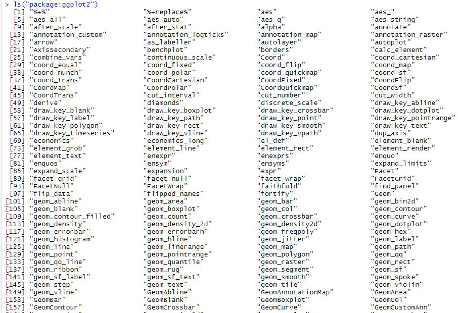
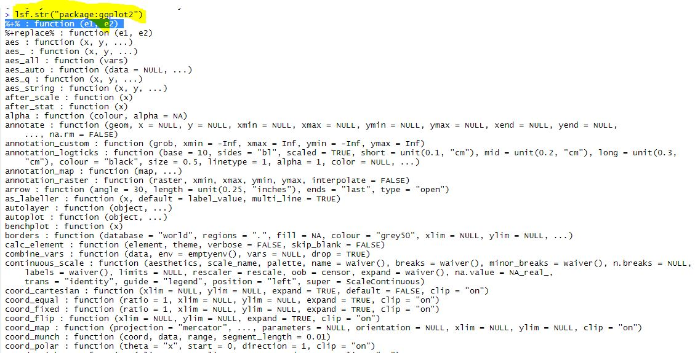
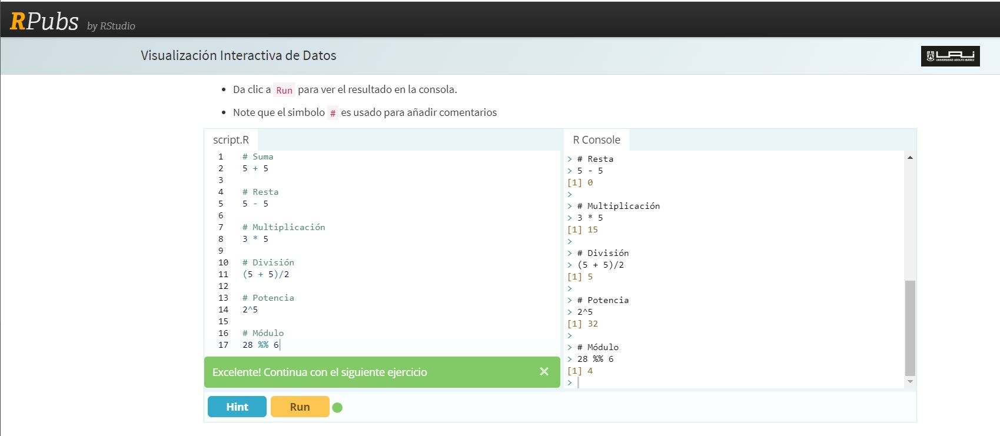

`Data Science` > [`Módulo02: Programación con R`]

### OBJETIVO
Utilizar las funcionalidades básicas de R para que funcione como calculadora. Identificar funciones clave para visualizar información sobre diferentes paquetes en R.   


#### DESARROLLO  

Para seguir practicando con ejercicios de la calculadora de R, podemos usar el siguiente <a href="https://rpubs.com/rparra/438560" target="_blank">link</a>. Aquí se encuentran ejercicios online, así como la definición de la sintaxis para hacer cualquier tipo de operación.   
**Las siguientes funciones te ayudarán a realizar diferentes tareas:**  

1. Para ver todos los objetos que contiene el paquete usaremos la función ls (list files):  
```
ls("package:ggplot2")
```  

2. Para conocer todas las funciones disponibles en el package, usa la función lsf.str:  
```
lsf.str("package:ggplot2")  
```


Ejercicio simple calculadora:


