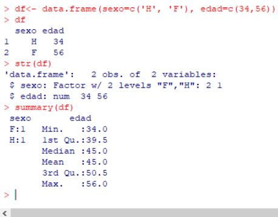
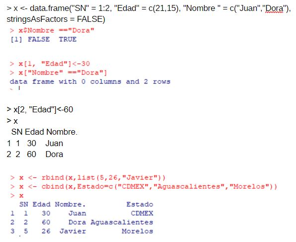
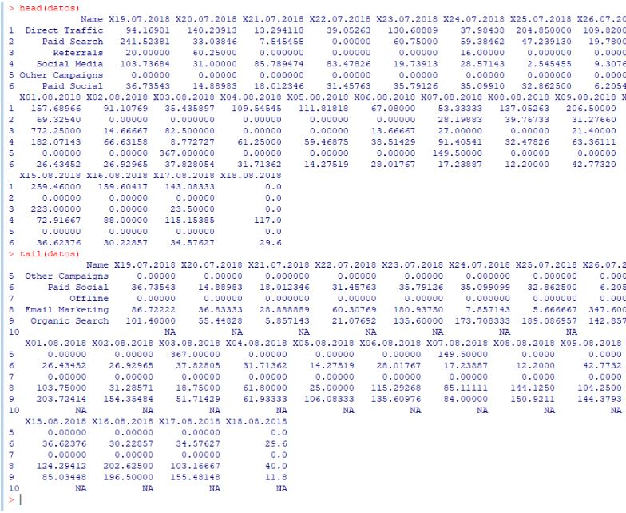

#### Apuntes

Estadística central nos da idea de dónde estamos centrados. 

- Si hay nulos
- Si hay outliers. Los altos o bajos de una muestra. Normalmente los quitamos. En machine learning, es importante no quitarlos, pero normalmente sí porque desvían de los datos centrales

Hay algunos casos en que hay que tomarlos como nominales. Un tipo de dato factor, hay que usarlos como factor. 

ej.: 
stringsAsFactors = FALSE

Crea categorías donde los elementos de la categoría, es 
[1] Juan Alma

[1][1] Juan
[1][2] Alma

Si le doy es str, me da el tipo del factor. Hay que convertir esos datos si no los queremos de esa manera. 

C(‘Juan’, ‘Alma’) 

Para leer excel, podemos usar una librería. 
...Los elementos del data frame se acceden  igual que los elementos de una matriz.
 
 >x[Nombre]
 >x[Nombre ==‘Dora’]

Hay que tener cuidado con los frames. Un dataframe es  una matriz. 

Quitamos: 
x[,-1] // es la columna
x[-1,] // es la fila

### LIMPIEZA DE DATOS
Parte crucial del análisis de datos para la preparación de los modelos. De no eliminar datos mal escritos o los outliers, pueden desviar las medias de los datos. 

Raw data
Technically correct data. Normalizar esos datos 
Consistent data. La escritura y consistencia de los datos. Ej.: si son NULL
Statistical results. Tabulate, plot
Formatted output

Cuando encuentres el nombre mal escrito, hay que sustituirlo.
Cuando no tenemos categoría, podemos colocarla entre las más frecuentes. 
Los datos entonces ya van a representar lo mismo. 

grep donde coincide la posición de lo que quiero obtener. Así puedo reemplazar en la cadena de caracteres. 

→ R es case sensitive

Tenemos que ir concatenando cachito por cachito para ir construyendo los datos. 
> tail(datos)
> head(datos)

