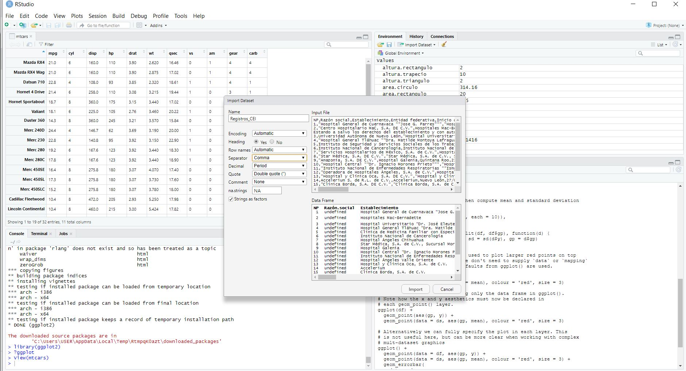
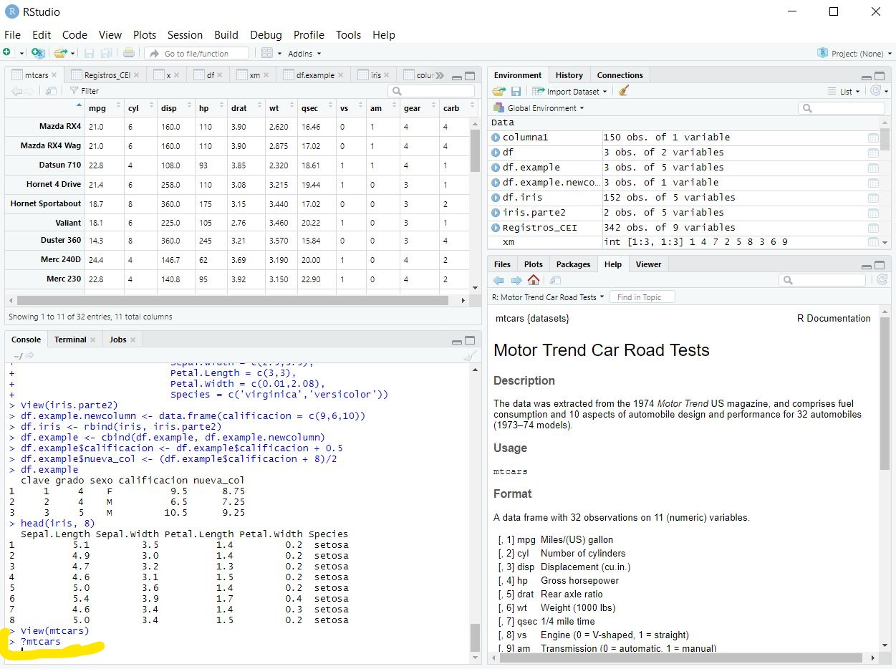

### OBJETIVO
- Entender la asignación de variables y operaciones basicas con R

#### EJEMPLO 1

1. Calcular el área de un rectángulo 
	
	#Area de un Rectangulo
	base.rectangulo <- 10
	altura.rectangulo <- 2
	area.rectangulo <- base.rectangulo * altura.rectangulo
	area.rectangulo
	

2. Calcular el área de un triangulo
	
	#Area de un Triangulo
	base.triangulo <- 10
	altura.triangulo <- 2
	area.triangulo <- (base.triangulo * altura.triangulo) / 2
	area.triangulo
	
	
3. Calcular el área de un Circulo
	
	#Area de un Circulo
	radio <- 10
	pi <- 3.1416
	area.circulo<- (pi * radio^2)
	area.circulo
		
5. Calcular el área de un Trapecio

	#Area de un Trapecio
	baseMenor <- 15
	baseMayor <- 30
	altura.trapecio <- 10
	area.trapecio<- ((baseMayor+baseMenor)/2)*altura.trapecio
	area.trapecio
		

#### EJEMPLO 2

#### DESARROLLO

Instalamos un paquete, ggplot2, que me permitiran hacer ejercicios de visualizacion.

```{r}
install.packages("ggplot2")
```

Cargando el paquete para poder usarlo. Esta operacion se repete cada vez que reinicie el programa y queramos usar el paquete

```{r}
library("ggplot2")
```

Solicitar ayuda / informacion de la descripcion y uso de este paquete

```{r}
?ggplot2
```
#### EJEMPLO 3

## Importación de dataset   
- Entender la importación de un dataset con RStudio, a partir de un repositorio en GitHub

1. Seleccionar el archivo `mtcars.csv` 
 
1. Abriremos **RStudio** seleccionaremos la opción de **Import Dataset** y elegiremos la opción **From Text (base)...**


 
1. Desplegaremos la estructura de nuestro DataSet con el comando **str(mtcars)** y la documentación de nuestro DataSet con el comando **?mtcars**
 

 


#### Reto2

Instalamos:

install.packages("dplyr")
library("dplyr")
?dplyr