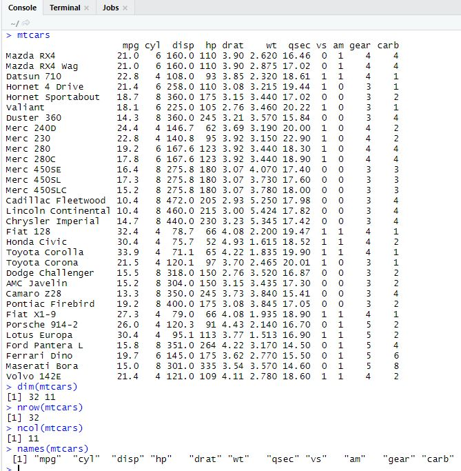
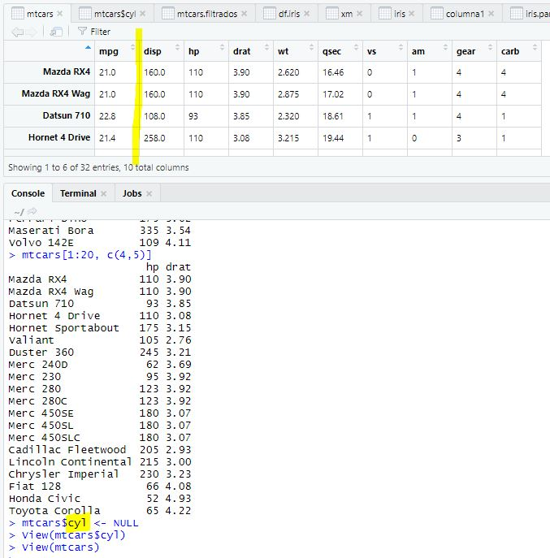

## Vectores

### 1

- Crea un vector con los números del 1 al 500, de 10 en 10.
- Guarda este vector con el nombre mi.vector
- ¿Cuál es el tamaño del vector?
- Al último elemento del vector, reemplazalo por el número -1.
- Multiplica este vector por 0.85 y sumale 10, guarda el resultado en mi.vector.transformado
- Ordena el vector mi.vector.transformado descendentemente


mi.vector <- seq(from = 1, to = 500, by = 10)
length(mi.vector)
mi.vector[length(mi.vector)] <- -1
mi.vector.transformado <- mi.vector*0.85 + 10
sort(mi.vector.transformado, decreasing = TRUE)

### 2

Al final de el `Reto-02` serás capaz de:
- Ver las características de un dataframe
- Accesar a los elementos de un dataframe
- Agregar datos a un dataframe
- Transformar una columna 
- Eliminar columnas de un dataframe

### INSTRUCCIONES DEL RETO

- Imprime el dataframe precargado en R **mtcars**
- Imprime el numero de renglones y columnas del dataframe
- Imprime el nombre de las columnas del dataframe



- Imprime el dato que esta en la tercer columna, quinto renglon del dataframe

```
mtcars[5,3]
```

- Imprime todos los renglones de la cuarta y quinta columna

```
mtcars[,c(4,5)]
```
- Imprime los primeros 20 renglones de la cuarta y quinta columna
```
mtcars[1:20, c(4,5)]
```

- Elimina la segunda columna del dataframe

mtcars$cyl <- NULL


