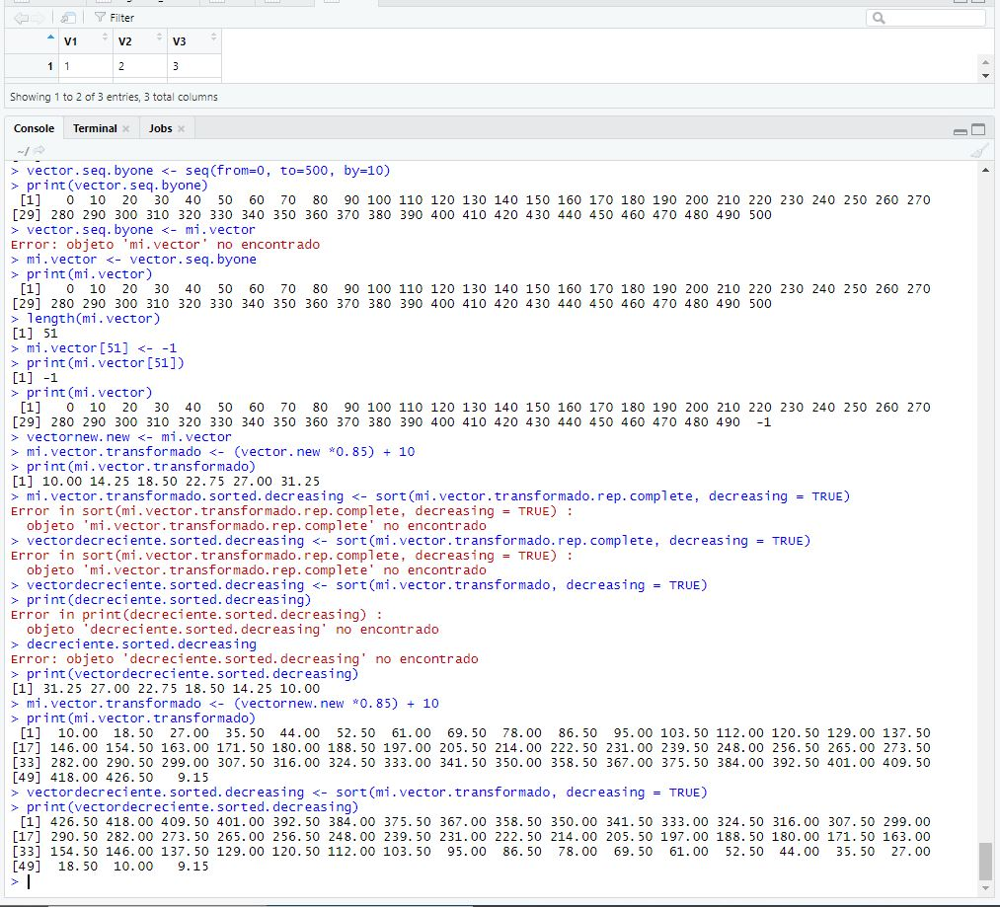

## Vectores

### 1

Al final de el `Reto-01` serás capaz de:
- Crear vectors utilizando diferentes funciones
- Identificar características de los vectores
- Operar con vectores

### INSTRUCCIONES DEL RETO

- Crea un vector con los números del 1 al 500, de 10 en 10.
- Guarda este vector con el nombre mi.vector
- ¿Cuál es el tamaño del vector?
- Al último elemento del vector, reemplazalo por el número -1.
- Multiplica este vector por 0.85 y sumale 10, guarda el resultado en mi.vector.transformado
- Ordena el vector mi.vector.transformado descendentemente

mi.vector <- seq(from = 1, to = 500, by = 10)
length(mi.vector)
mi.vector[length(mi.vector)] <- -1
mi.vector.transformado <- mi.vector*0.85 + 10
sort(mi.vector.transformado, decreasing = TRUE)
