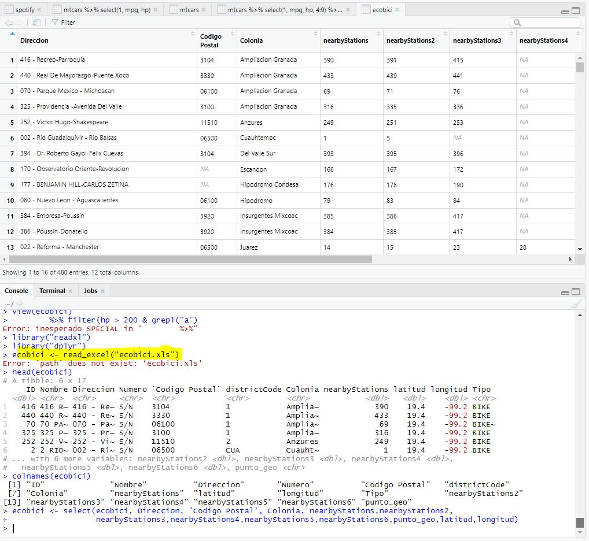

### Reto 01

#### DESARROLLO
Importamos el dataset de **Spotify**, desplegaremos su estructura e identifiaremos la variable del tiempo que se encuentra en **ms** , se realizaran las operaciones necesarias para convertir el valor a **minutos**


### Reto 02

#### DESARROLLO
Importamos la tabla de Ecobici con la que hemos estado trabajando (hint: read_excel). A nuestra tabla la llamaremos "ecobici".
Observaremos la calidad de los datos importados y seleccionaremos las variables mas importantes para el analisis (hint: select). 




### Ejemplo 03 - Dplyr en un solo comando

#### DESARROLLO
Con la ayuda del package dplyr, haremos los siguientes comandos con una sola orden (Hint: usar "%>%")
```{r}
library(dplyr)
```

Usa la base de datos precargada llamada iris y calcula la media de la sepal.length y la sepal.width segun la especie.
Finalmente, ordena los resultas alfabeticamente segun la especie. 
```{r}
head(iris)
library
iris <- iris # Guardo la tabla en la memoria de objetos
iris %>% # Datos que usare
  group_by(Species) %>% # Variable de agrupacion
  summarise(Media_Sepal_Length = mean(Sepal.Length), # Media de sepal length
            Media_Sepal_Width = mean(Sepal.Width)) %>% # Media de sepal width
  arrange(Species) # Ordenar por especies (por defecto es orden ascendiente)
```


### Reto 03

#### DESARROLLO

Sobre la tabla de ecobici que ya estamos trabajando, crearemos un comando optimizado de varias ordenes apoyandote de la funcion %>%. La primera orden sera un recuento de las estaciones que hay en cada colonia (hint: count). A continuacion pediremos que se ordenen alfabeticamente por nombre de la Colonia. 

