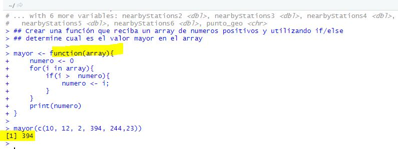

## Funciones, condiciones y loops

#### Reto 4 - DESARROLLO

 Crear una función que reciba un array de numeros positivos y utilizando if/else 
 determine cual es el valor mayor en el array

mayor <- function(array){
  numero <- 0
  for(i in array){
    if(i >  numero){
      numero <- i;
    }
  }
  print(numero)
}

mayor(c(10, 12, 2, 394, 244,23))

#### Reto 5 - DESARROLLO

- Investigar el detalle de cada columna del DataSet.

- Utilizando ciclo For y la sentencia IF/ELSE; 
    * Contar cuantos días el promedio de velocidad del aire es: Mayor a 7, Menor a 4 y 
      cuántos registros existen dentro de ese rango(4-7). 
    
- Calcular el promedio total de la Columna Temp.

#### Reto - 6 DESARROLLO
Seguimos trabajando con la base de ecobici. Ahora queremos comprobar la consistencia entre nombres de Colonias y Codigos Postales. Para ello, usaremos la funcion unique, y llevaremos todos los posibles Codigos Postales de aquellas colonias que se llamen "Roma Norte".

library("readxl")
ecobici <- as.data.frame(read_excel("ecobici.xls"))
head(ecobici)

unique(ecobici[ecobici$Colonia == 'Roma Norte',]$'Codigo Postal')

