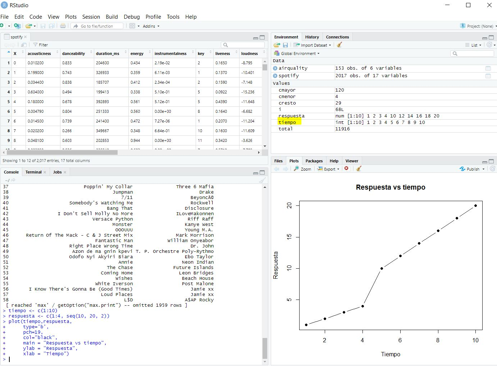
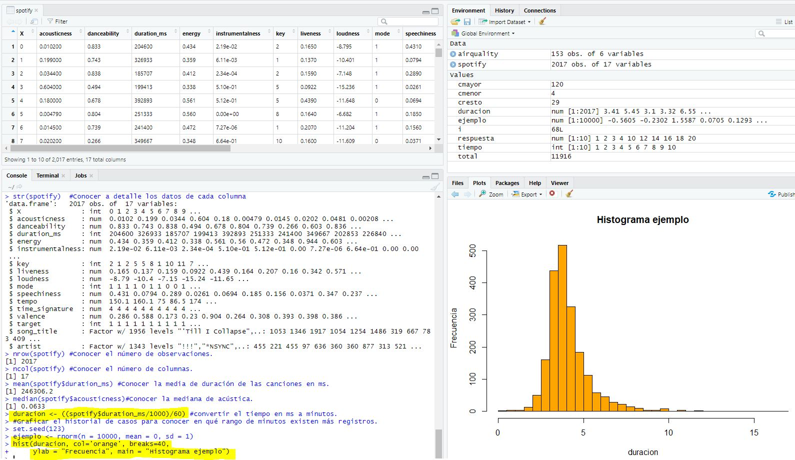
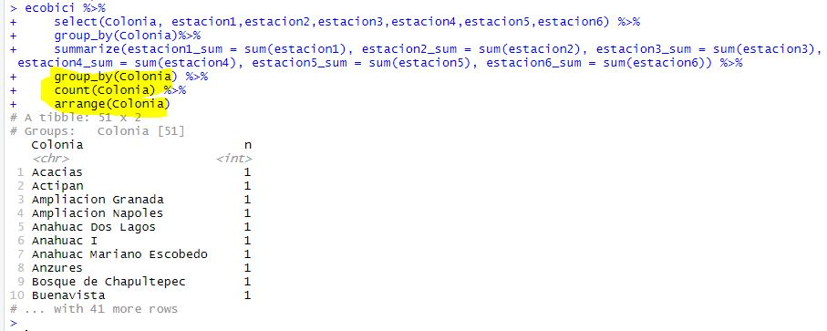

`Data Science` > [`Programacion con R`]
## Exploracion de datos

### Reto 1
- Comprobar la estructura de la tabla
- Extraer variables en funcion de otras 

#### DESARROLLO
Vamos a usar la funcion str() para ver la estructura de cada una de las columnas de la tabla. A continuacion, checaremos cuales son las colonias que tienen mas estaciones alrededor. Para hacerlo, usaremos el package dplyr, seleccionaremos las variables Colonia y nearbyStations6 y usaremos la funcion na.omit() para asegurarnos que la variable nearbyStations6 contenga algun valor. 

``
head(ecobici)

str(ecobici)

ecobici %>% 
  select(Colonia,nearbyStations6) %>%
  na.omit(nearbyStations6)

``

## Ejemplo 1

#### DESARROLLO

Importamos la base de datos de spotify.
Conocer como está estructurado el dataset
Conocer a detalle los datos de cada columna 
Conocer el número de observaciones.
Conocer el número de columnas.
Conocer la media de duración de las canciones en ms.
Conocer la mediana de acústica.
Graficar el historial de casos para conocer en qué rango de minutos existen más registros.

```{r}
head(spotify)
str(spotify)
nrow(spotify)
ncol(spotify)
mean(spotify$duration_ms)
median(spotify$acousticness)

```

Convertir el tiempo en ms a minutos.

```{r}
duracion <- ((spotify$duration_ms/1000)/60)
```
Graficar el historial de casos para conocer en qué rango de minutos existen más registros.

```{r}
set.seed(123)
ejemplo <- rnorm(n = 10000, mean = 0, sd = 1)
hist(duracion, col='orange', breaks=40, 
     ylab = "Frecuencia", main = "Histograma ejemplo")
```






## Reto 2

### OBJETIVO
- Comprobar la estructura de la tabla
- Ver correlaciones entre variables

#### REQUISITOS
1. Contar con R studio.
1. Usar la carpeta de trabajo `Sesion04/Reto-02`

#### DESARROLLO
Usaremos las variables que crearmos en el reto 1 de la Sesion 3: 
```{r}
ecobici$estacion1 <- ifelse(ecobici$nearbyStations>=1, 1, 0)
ecobici$estacion2 <- ifelse(ecobici$nearbyStations2>=1, 1, 0)
ecobici$estacion3 <- ifelse(ecobici$nearbyStations3>=1, 1, 0)
ecobici$estacion4 <- ifelse(ecobici$nearbyStations4>=1, 1, 0)
ecobici$estacion5 <- ifelse(ecobici$nearbyStations5>=1, 1, 0)
ecobici$estacion6 <- ifelse(ecobici$nearbyStations6>=1, 1, 0)
```

A continuacion, crearemos una tabla apoyandonos del package dplyr seleccionando las Colonias y las nuevas seis variables, agruparemos la informacion por colonia, y veremos cuantas estaciones tiene cerca cada una de las colonias (hint: summarize(sum())). Finalmente, ordenaremos la informacion alfabeticamente por colonia. 




library("readxl")
library("dplyr")
ecobici <- read_excel("ecobici.xls")
head(ecobici)

ecobici$estacion1 <- ifelse(ecobici$nearbyStations>=1, 1, 0)
ecobici$estacion2 <- ifelse(ecobici$nearbyStations2>=1, 1, 0)
ecobici$estacion3 <- ifelse(ecobici$nearbyStations3>=1, 1, 0)
ecobici$estacion4 <- ifelse(ecobici$nearbyStations4>=1, 1, 0)
ecobici$estacion5 <- ifelse(ecobici$nearbyStations5>=1, 1, 0)
ecobici$estacion6 <- ifelse(ecobici$nearbyStations6>=1, 1, 0)

ecobici %>% 
  select(Colonia, estacion1,estacion2,estacion3,estacion4,estacion5,estacion6) %>%
  group_by(Colonia)%>% 
  summarize(sum(estacion1),sum(estacion2),sum(estacion3),sum(estacion4),sum(estacion5),sum(estacion6)) %>%
  arrange(Colonia)

